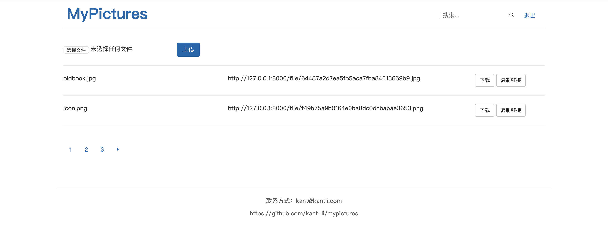

# mypictures
Django写的简单图床（文件中转）应用，支持用户区分、文件名搜索等。

## 用法
0. 记得添加 ALLOW_HOSTS ，设置 DEBUG 为 False

1. 直接部署Django应用
```python
# 数据迁移
python manage.py makemigrations
python manage.py migrate

python manage.py makemigrations pictures
python manage.py migrate

# 开启服务器
python manage.py runserver

```

2. 通过shell命令添加用户
```python
python manage.py shell

from django.contrib.auth.models import User
user = User.objects.create_user('username', 'email', 'password')
user.save()

```

3. 登录页面，开始上传文件

3.1 登录


3.2 上传
